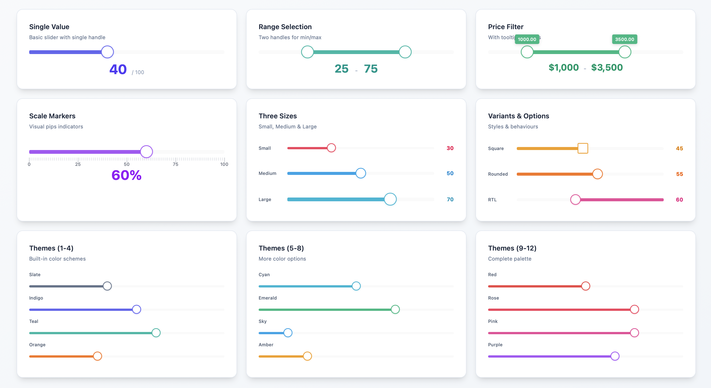

# Livewire Range Slider



[](https://packagist.org/packages/sadam/livewire-range-slider) [](https://github.com/sadamegal/livewire-range-slider/blob/main/LICENSE.md) [](https://packagist.org/packages/sadam/livewire-range-slider)


A feature-rich, customizable range slider component for Laravel Livewire applications, built on noUiSlider with Alpine.js integration.

> **v1.0.0 - First Stable Release!** This package is now production-ready with comprehensive features and proper asset management.

> **Upgrading from v0.10?** This release includes significant improvements and breaking changes. Please read the [Migration Guide](#migration-guide) before updating.

> Compatibility: Supports Livewire v3 and v4.

## Table of Contents

- [Installation](#installation)
- [Requirements](#requirements)
- [What's New](#whats-new)
- [Basic Usage](#basic-usage)
- [Available Props](#available-props)
- [Wire Model Modifiers](#wire-model-modifiers)
- [Examples](#examples)
- [Configuration](#configuration)
- [Custom Styling](#custom-styling)
- [Keyboard Support](#keyboard-support)
- [Browser Support](#browser-support)
- [Migration Guide](#migration-guide)
- [Credits](#credits)
- [License](#license)
- [Support](#support)

## Installation

Install via Composer:

```bash
composer require sadam/livewire-range-slider
```

Publish the assets:

```bash
php artisan vendor:publish --tag=livewire-range-slider-assets
```
> ****⚠️ Note: The package won’t work properly without publishing these assets.****

Optionally, publish the configuration file:

```bash
php artisan vendor:publish --tag=livewire-range-slider-config
```

## Requirements

- PHP 8.1 or higher
- Laravel 10.x, 11.x, or 12.x
- Livewire 3.x or 4.x

## What's New

This version introduces major improvements over the previous v0.10 release:

- **Simplified Installation**: No npm dependencies required - noUiSlider is now bundled
- **Flexible Wire Models**: Bind to single values or arrays (previously arrays only)
- **Built-in Themes**: 12 color themes out of the box (see [Themes](#themes))
- **New Features**: [Tooltips](#available-props), [pips](#pips-scale-markers), [sizes](#sizes), [variants](#variants), RTL support, and more
- **Configuration File**: Set project-wide defaults (see [Configuration](#configuration))
- **Improved Keyboard Support**: Better debouncing and performance (see [Keyboard Support](#keyboard-support))

**For existing users:** Please see the [Migration Guide](#migration-guide) below for detailed upgrade instructions.

## Basic Usage

### Single Value Slider

```blade
<x-range-slider 
    wire:model.live="price" 
    :min="0" 
    :max="1000" 
    :step="10"
/>
```

```php
class PriceFilter extends Component
{
    public $price = 500;
}
```

*See [Wire Model Modifiers](#wire-model-modifiers) for more options like `wire:model.live` and `wire:model.blur`.*

### Range Slider (Multiple Handles)

```blade
<x-range-slider 
    wire:model="priceRange" 
    :min="0" 
    :max="1000"
/>
```

```php
class PriceFilter extends Component
{
    public $priceRange = [200, 800];
    
    // You can also use 3+ handles
    // public $quartiles = [100, 300, 600, 900];
}
```

## Available Props

| Prop | Type | Default | Description |
|------|------|---------|-------------|
| `min` | int/float | 1 | Minimum value |
| `max` | int/float | 100 | Maximum value |
| `step` | float | 1 | Step increment |
| `tooltips` | bool | true | Show value tooltips |
| `pips` | bool/array | false | Show scale markers |
| `theme` | string | 'indigo' | Color theme |
| `size` | string | 'medium' | Slider size |
| `variant` | string | 'rounded' | Handle shape |
| `direction` | string | 'ltr' | Slider direction |
| `behaviour` | string | 'tap' | Interaction behavior |

### Themes

Available themes: `slate`, `indigo`, `teal`, `orange`, `cyan`, `emerald`, `sky`, `amber`, `red`, `rose`, `pink`, `purple`

```blade
<x-range-slider wire:model="value" theme="emerald" />
```

See more examples in the [Examples](#examples) section.

### Sizes

Available sizes: `small`, `medium`, `large`

```blade
<x-range-slider wire:model="value" size="large" />
```

### Variants

Available variants: `square`, `rounded`

```blade
<x-range-slider wire:model="value" variant="square" />
```

### Pips (Scale Markers)

Show evenly distributed markers:

```blade
<x-range-slider wire:model="value" :pips="true" />
```

Show markers at specific values:

```blade
<x-range-slider wire:model="value" :pips="[0, 25, 50, 75, 100]" />
```

### Behaviour

Controls slider interaction. Common values:

- `tap` - Click to set value
- `drag` - Drag handles only
- `tap-drag` - Both tap and drag
- `snap` - Snap to steps
- `fixed` - Maintain handle distance

See [noUiSlider documentation](https://refreshless.com/nouislider/behaviour-option/) for all options.

```blade
<x-range-slider wire:model="value" behaviour="snap" />
```

## Wire Model Modifiers

### Live Updates

Update on every change (optimized - only fires after drag ends):

```blade
<x-range-slider wire:model.live="price" />
```

### Blur Updates

Update when handle loses focus:

```blade
<x-range-slider wire:model.blur="price" />
```

### Deferred Updates

Update when form is submitted (default):

```blade
<x-range-slider wire:model="price" />
```

## Examples

### Price Filter with Theme

```blade
<div>
    <x-range-slider 
        wire:model.live="priceRange"
        :min="0"
        :max="5000"
        :step="50"
        theme="indigo"
        size="medium"
        :pips="[0, 1000, 2500, 5000]"
        :tooltips="true"
    />
    
    <p>Price: ${{ $priceRange[0] }} - ${{ $priceRange[1] }}</p>
</div>
```

### Volume Control

```blade
<x-range-slider 
    wire:model="volume"
    :min="0"
    :max="100"
    :step="1"
    theme="purple"
    size="small"
    behaviour="snap"
/>
```

### Age Range Selector

```blade
<x-range-slider 
    wire:model="ageRange"
    :min="18"
    :max="100"
    :step="1"
    :tooltips="true"
    :pips="true"
    theme="teal"
    variant="square"
/>
```

## Configuration

Customize default values by editing `config/livewire-range-slider.php`:

```php
return [
    'theme' => 'indigo',
    'size' => 'medium',
    'variant' => 'rounded',
    'direction' => 'ltr',
    'behaviour' => 'tap',
    'pips' => false,
    'step' => 1,
    'min' => 1,
    'max' => 100,
    'tooltips' => true,
];
```

See how to publish the configuration file in the [Installation](#installation) section.

## Custom Styling

You can customize the published `public/vendor/livewire-range-slider/range-slider.css` file directly.
See available [theme options](#themes)

## Keyboard Support

The slider fully supports keyboard navigation:

- Arrow keys to adjust values
- Tab to switch between handles (for range sliders)
- Optimized debouncing for keyboard input to reduce server requests

## Browser Support

Supports all modern browsers that support Alpine.js and noUiSlider.

## Migration Guide

### Upgrading from Previous Version (v0.10)

This guide will help you migrate from the previous v0.10 version to the current release.

#### Overview of Changes

**Major Improvements:**
- **No npm Required**: noUiSlider is now bundled - no need to install via npm or modify `app.js`
- **Simplified Wire Model**: Can now bind to single values OR arrays (previously required arrays only)
- **Built-in Theming**: 12 color themes out of the box (previously required manual CSS)
- **Configuration File**: Set project-wide defaults
- **New Features**: Tooltips, pips (scale markers), sizes, variants, RTL support, and customizable behaviour
- **Better Developer Experience**: Comprehensive prop validation and sensible defaults

**Breaking Changes:**
1. Asset management changed - must publish assets
2. Wire model now accepts single values or arrays (previously arrays only)
3. Minimum PHP version is now 8.1
4. Component props expanded from 3 to 11

#### Step-by-Step Migration

##### Step 1: Clean Up npm Installation

If you installed noUiSlider manually for the old version, remove it:

```bash
# Remove from package.json
npm uninstall nouislider
```

Remove the imports from `resources/js/app.js`:

```javascript
// DELETE THESE LINES:
import noUiSlider from 'nouislider';
import 'nouislider/dist/nouislider.css';
window.noUiSlider = noUiSlider;
```

Rebuild your assets:

```bash
npm run build
```

##### Step 2: Publish Package Assets

The new version bundles noUiSlider and publishes it to your public directory:

```bash
php artisan vendor:publish --tag=livewire-range-slider-assets
```

This creates:
- `public/vendor/livewire-range-slider/nouislider.min.js`
- `public/vendor/livewire-range-slider/nouislider.min.css`
- `public/vendor/livewire-range-slider/range-slider.css`

##### Step 3: Update Component Properties

**For Single Value Sliders**

Before:
```php
public $values = [50]; // Had to be an array
```

```blade
<x-range-slider :min="0" :max="100" :step="1" wire:model="values" />
```

After:
```php
public $price = 50; // Can now be a single value
```

```blade
<x-range-slider :min="0" :max="100" :step="1" wire:model="price" />
```

**For Range Sliders**

Before:
```php
public $values = [30, 70];
```

```blade
<x-range-slider :min="0" :max="100" :step="1" wire:model="values" />
```

After (same, but with optional enhancements):
```php
public $priceRange = [30, 70];
```

```blade
<x-range-slider 
    wire:model="priceRange"
    :min="0" 
    :max="100" 
    :step="1"
    theme="indigo"
    :tooltips="true"
/>
```

##### Step 4: Replace Custom CSS with Themes (Optional)

Before - You had to write custom CSS:
```css
.noUi-target {
    background-color: #8BC34A;
    height: 12px;
    border-radius: 6px;
}

.noUi-handle {
    background-color: #212121;
    border: 2px solid #FFEB3B;
}

.noUi-connect {
    background-color: #FFEB3B;
}
```

After - Use built-in themes:
```blade
<x-range-slider wire:model="price" theme="emerald" size="medium" />
```

Available themes: `slate`, `indigo`, `teal`, `orange`, `cyan`, `emerald`, `sky`, `amber`, `red`, `rose`, `pink`, `purple`

##### Step 5: Use New Features (Optional)

Add tooltips:
```blade
<x-range-slider wire:model="price" :tooltips="true" />
```

Add scale markers:
```blade
<!-- Evenly distributed -->
<x-range-slider wire:model="price" :pips="true" />

<!-- At specific values -->
<x-range-slider wire:model="price" :pips="[0, 25, 50, 75, 100]" />
```

Choose a size:
```blade
<x-range-slider wire:model="price" size="large" />
```

Choose a variant:
```blade
<x-range-slider wire:model="price" variant="square" />
```

##### Step 6: Publish Configuration (Optional)

Set project-wide defaults:

```bash
php artisan vendor:publish --tag=livewire-range-slider-config
```

Edit `config/livewire-range-slider.php`:

```php
return [
    'theme' => 'indigo',
    'size' => 'medium',
    'variant' => 'rounded',
    'tooltips' => true,
    'pips' => false,
    // ... more options
];
```

#### Comparison Table

| Feature | Old Version | New Version |
|---------|-------------|-------------|
| **Installation** | npm install + app.js config | Just publish assets |
| **Wire Model** | Arrays only (`$values = [50]`) | Single value or array |
| **Props** | 3 (min, max, step) | 11 (see [Available Props](#available-props)) |
| **Themes** | Manual CSS required | 12 built-in themes |
| **Tooltips** | Manual CSS required | Built-in prop |
| **Pips** | Not available | Built-in prop |
| **Sizes** | Not available | small, medium, large |
| **Configuration** | Not available | [Config file](#configuration) support |
| **PHP Version** | Any | 8.1+ |

#### Complete Example

**Before:**
```php
// Component
public $values = [200, 800];
```

```blade
<x-range-slider :min="0" :max="1000" :step="10" wire:model="values" />
```

```css
/* Custom CSS required */
.noUi-target { background-color: #8BC34A; }
.noUi-handle { background-color: #212121; }
.noUi-connect { background-color: #FFEB3B; }
```

**After:**
```php
// Component
public $priceRange = [200, 800];
```

```blade
<x-range-slider 
    wire:model.live="priceRange"
    :min="0" 
    :max="1000" 
    :step="10"
    theme="emerald"
    size="medium"
    :tooltips="true"
    :pips="[0, 250, 500, 750, 1000]"
/>
```

No CSS required!

#### Troubleshooting

**Slider Not Appearing**

Make sure you published the assets:
```bash
php artisan vendor:publish --tag=livewire-range-slider-assets --force
```

See the [Installation](#installation) section for more details.

**Old Styles Conflicting**

If you have custom CSS from the old version, it might conflict with the new themes. Either:
1. Remove your custom CSS and use built-in themes (see [Available Props](#available-props))
2. You can customize the published `public/vendor/livewire-range-slider/range-slider.css` file directly.
   See available [theme options](#themes)

**Wire Model Not Working**

Make sure you're using the correct binding:
- Single value: `public $price = 50;`
- Range: `public $range = [20, 80];`
- Multiple handles: `public $values = [10, 30, 60, 90];`

See [Basic Usage](#basic-usage) for examples.

---

[↑ Back to top](#livewire-range-slider)

## Credits

Built with:
- [noUiSlider](https://refreshless.com/nouislider/)
- [Alpine.js](https://alpinejs.dev/)
- [Livewire](https://livewire.laravel.com/)

## License

MIT License. See [LICENSE](LICENSE.md) for details.

